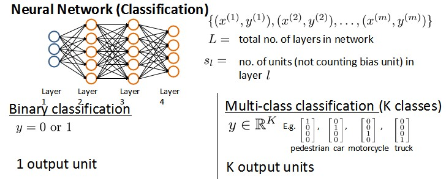
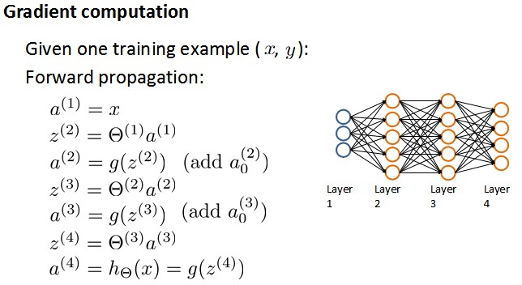
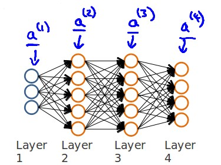
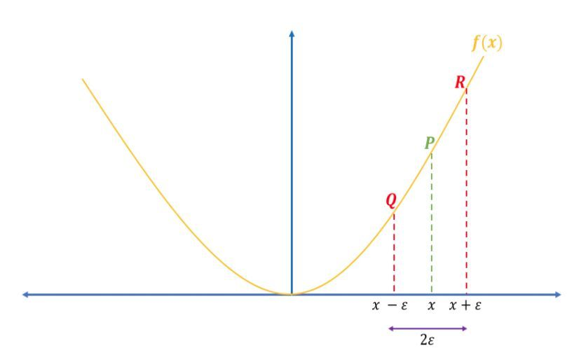

### 1、数据量与特征量

数据量m<<特征量n

- 删除相关特征

- 使用正则化的线性代数方法

### 2、损失函数

损失函数，通过似然估计、误差大小或者是否误分等方式得到，主要看模型性质 

- hinge loss(SVM) 

- 0-1 loss(感知机) 

- sqr loss(Linear regression)

- 对数损失(logistic regression)

  逻辑回归使用误差平方和的话，会导致损失函数有许多局部最小值：

  

  重新定义误差函数为对数损失，使得${h_\theta}\left( x \right)$与 $Cost\left( {h_\theta}\left( x \right),y \right)$之间的关系如下：

  

  

  最终的损失函数为：
  $$
  Cost\left( {h_\theta}\left( x \right),y \right)=-y\times log\left( {h_\theta}\left( x \right) \right)-(1-y)\times log\left( 1-{h_\theta}\left( x \right) \right)
  $$

- 指数损失(adaboost) 

### 3、正则项

正则项里$\theta$参数不包括$\theta_0$，因为只惩罚高次项，所以更新规则为：

   ${\theta_0}:={\theta_0}-a\frac{1}{m}\sum\limits_{i=1}^{m}{(({h_\theta}({{x}^{(i)}})-{{y}^{(i)}})x_{0}^{(i)}})$ 

   ${\theta_j}:={\theta_j}-a[\frac{1}{m}\sum\limits_{i=1}^{m}{(({h_\theta}({{x}^{(i)}})-{{y}^{(i)}})x_{j}^{\left( i \right)}}+\frac{\lambda }{m}{\theta_j}]$ 

   for $j=1,2,...n$

### 4、神经网络

下面引入一些标记法来帮助描述模型：
$a_{i}^{\left( j \right)}$ 代表第$j$ 层的第 $i$ 个激活单元。${{\theta }^{\left( j \right)}}$代表从第 $j$ 层映射到第$ j+1$ 层时的权重的矩阵，例如${{\theta }^{\left( 1 \right)}}$代表从第一层映射到第二层的权重的矩阵。其尺寸为：以第 $j+1$层的激活单元数量为行数，以第 $j$ 层的激活单元数加一为列数的矩阵。例如：上图所示的神经网络中${{\theta }^{\left( 1 \right)}}$的尺寸为 3*4。

$a_{1}^{(2)}=g(\Theta _{10}^{(1)}{{x}_{0}}+\Theta _{11}^{(1)}{{x}_{1}}+\Theta _{12}^{(1)}{{x}_{2}}+\Theta _{13}^{(1)}{{x}_{3}})$
$a_{2}^{(2)}=g(\Theta _{20}^{(1)}{{x}_{0}}+\Theta _{21}^{(1)}{{x}_{1}}+\Theta _{22}^{(1)}{{x}_{2}}+\Theta _{23}^{(1)}{{x}_{3}})$
$a_{3}^{(2)}=g(\Theta _{30}^{(1)}{{x}_{0}}+\Theta _{31}^{(1)}{{x}_{1}}+\Theta _{32}^{(1)}{{x}_{2}}+\Theta _{33}^{(1)}{{x}_{3}})$

${{h}_{\Theta }}(x)=g(\Theta _{10}^{(2)}a_{0}^{(2)}+\Theta _{11}^{(2)}a_{1}^{(2)}+\Theta _{12}^{(2)}a_{2}^{(2)}+\Theta _{13}^{(2)}a_{3}^{(2)})$

即每一层l的输出：$a^{(l)} = g(\Theta^{(l-1)} a^{(l-1)})$ + $a_0^{(l-1)}$

**注意在计算每一层的输入时，都应该在加上一个偏差单位，如$x_0$,$a_0$**。假设n个隐藏节点，则偏差单位是一个n*1的矩阵。

我们可以知道：每一个$a$都是由上一层所有的$x$和每一个$x$所对应的$\Theta$决定的。

（我们把这样从左到右的算法称为**前向传播算法( FORWARD PROPAGATION )**）

### 5、代价函数

假设神经网络的训练样本有$m$个，每个包含一组输入$x$和一组输出信号$y$，$L$表示神经网络层数，$S_I$表示每层的**neuron**个数($S_l$表示输出层神经元个数)，$S_L$代表最后一层中处理单元的个数，即分类个数。

将神经网络的分类定义为两种情况：二类分类和多类分类，

如图所示：

- $S_L = k$(k = 1为二分类；k>=3为k分类 )
- $s_l$即$l$层的神经单元个数，不包含偏差单位

我们回顾逻辑回归问题中我们的代价函数为：

$  J\left(\theta \right)=-\frac{1}{m}\left[\sum_\limits{i=1}^{m}{y}^{(i)}\log{h_\theta({x}^{(i)})}+\left(1-{y}^{(i)}\right)log\left(1-h_\theta\left({x}^{(i)}\right)\right)\right]+\frac{\lambda}{2m}\sum_\limits{j=1}^{n}{\theta_j}^{2}  $

在逻辑回归中，我们只有一个输出变量，又称标量（**scalar**），也只有一个因变量$y$，但是在神经网络中，我们可以有很多输出变量，我们的$h_\theta(x)$是一个维度为$K$的向量，并且我们训练集中的因变量也是同样维度的一个向量，因此我们的代价函数会比逻辑回归更加复杂一些，为：$\newcommand{\subk}[1]{ #1_k }$
$$h_\theta\left(x\right)\in \mathbb{R}^{K}$$ $${\left({h_\theta}\left(x\right)\right)}_{i}={i}^{th} \text{output}$$

$J(\Theta) = -\frac{1}{m} \left[ \sum\limits_{i=1}^{m} \sum\limits_{k=1}^{k} {y_k}^{(i)} \log \subk{(h_\Theta(x^{(i)}))} + \left( 1 - y_k^{(i)} \right) \log \left( 1- \subk{\left( h_\Theta \left( x^{(i)} \right) \right)} \right) \right] + \frac{\lambda}{2m} \sum\limits_{l=1}^{L-1} \sum\limits_{i=1}^{s_l} \sum\limits_{j=1}^{s_{l+1}} \left( \Theta_{ji}^{(l)} \right)^2$

L-1是因为最后一层并不需要计算$\Theta$参数。

这个看起来复杂很多的代价函数背后的思想还是一样的，我们希望通过代价函数来观察算法预测的结果与真实情况的误差有多大，唯一不同的是，对于每一行特征，我们都会给出$K$个预测，基本上我们可以利用循环，对每一行特征都预测$K$个不同结果，然后在利用循环在$K$个预测中选择可能性最高的一个，将其与$y$中的实际数据进行比较。

正则化的那一项只是排除了每一层$\theta_0$后，每一层的$\theta$ 矩阵的和。最里层的循环$j$循环所有的行（由$s_{l+1}$  层的激活单元数决定），循环$i$则循环所有的列，由该层（$s_l$层）的激活单元数所决定。

### 6、后向传播

后向传播的参数求解如下：

目标：$\min \frac {\partial J(\theta)}{\partial \theta} = min \frac {\partial J(\theta)}{\partial z}  \frac {\partial z}{\partial \theta} $

**这里定义$\sigma = \frac {\partial J(\theta)}{\partial z}$作为每一层的残差**

假设

input  :  X

hidden(L-2)  :  $z^{(L-2)}|\alpha^{(L-2)}$

hidden(L-1)  :  $z^{(L-1)}|\alpha^{(L-1)}$

output(L) :  $z^{(L)}|\alpha^{(L)}$

- 输出层的残差
  $$
  \sigma ^{(L)} = \frac {\partial J(\theta)} {\partial z^{(L)}} = \frac {\partial J(\theta)} {\partial \alpha^{(L)}} \frac {\partial \alpha^{(L)}} {\partial z^{(L)}} =(\frac {(1-y)} {1-\alpha^{(L)}} - \frac {y} {\alpha^{(L)}}) \alpha^{(L)}(1-\alpha^{(L)}) = \alpha^{(L)}-y
  $$

- 隐藏层的残差
  $$
  \sigma ^{(L-1)} = \frac {\partial J(\theta)} {\partial z^{(L-1)}} 
  = \frac {\partial J(\theta)} {\partial \alpha^{(L)}} \frac {\partial \alpha^{(L)}} {\partial z^{(L)}}\frac {\partial z^{(L)}} {\partial \alpha^{(L-1)}} \frac {\partial \alpha^{(L-1)}} {\partial z^{(L-1)}}
  = (\alpha^{(L)}-y) \theta^{(L-1)}a' = \sigma ^{(L)}\theta^{(L-1)}a'
  $$

- 输入层的残差

  输入层不用进行反向传播

$$
\frac {\partial z}{\partial \theta}  = \alpha^{(L)} \\
\frac {\partial J(\theta)}{\partial \Theta^{(l)}} = \alpha^{(l)} \sigma ^{(l+1)}
$$

即偏导数为该层的输出值乘上下一层计算出来的误差。

### 7、梯度检验

当我们对一个较为复杂的模型（例如神经网络）使用梯度下降算法时，可能会存在一些不容易察觉的错误，意味着，虽然代价看上去在不断减小，但最终的结果可能并不是最优解。

为了避免这样的问题，我们采取一种叫做梯度的数值检验（**Numerical Gradient Checking**）方法。这种方法的思想是通过估计梯度值来检验我们计算的导数值是否真的是我们要求的。

这里有两种数值梯度的计算方法：

- 右边形式：
- (1) [J($\theta + \epsilon$)−J($\theta$)]/$\epsilon$
- 双边形式（见图 2）：
- (2) [J($\theta + \epsilon$)−J($\theta- \epsilon$)]/2$\epsilon$

逼近导数的双边形式比右边形式更接近真实值。我们以 $f(x)=x^2$ 为例，在 x=3 处计算导数。

- 解析导数：
  $$
  \bigtriangledown _x f(x) = 2 x \\
  \bigtriangledown _x f(3) = 6
  $$

- 双边数值导数：$[(3 + (1e-2))^2 - (3-(1e-2)^2)]/2*(1e-2)=5.999999999999872$

- 右边数值导数：

  $[(3 + (1e-2))^2 - (3)^2)]/(1e-2)=6.009999999999849$

解析梯度：即原来的偏导数值，即上面的6

以下是完成梯度检验的步骤：

1. 随机从训练集中抽取一些样本，用来计算数值梯度和解析梯度（不要使用所有训练样本，因为梯度检验运行会很慢）。

2. 初始化参数。

3. 计算前向传播和交叉熵损失。

4. 利用写好的反向传播的实现代码计算梯度（解析梯度）。

5. 计算双边形式的数值梯度。

6. 计算数值梯度和解析解梯度的差值。

### 8、综合过程

训练神经网络：

1. 参数的随机初始化

   初始所有参数为0，这样的初始方法对于逻辑回归来说是可行的，但是对于神经网络来说是不可行的。如果我们令所有的初始参数都为0，这将意味着我们第二层的所有激活单元都会有相同的值。同理，如果我们初始所有的参数都为一个非0的数，结果也是一样的，我们通常初始参数为正负ε之间的随机值。

2. 利用正向传播方法计算所有的$h_{\theta}(x)$

3. 编写计算代价函数 $J$ 的代码

4. 利用反向传播方法计算所有偏导数

5. 利用数值检验方法检验这些偏导数

6. 使用优化算法来最小化代价函数

### 9、Relu激活函数

为什么引入Relu呢？

第一，采用sigmoid等函数，算激活函数时（指数运算），计算量大，反向传播求误差梯度时，求导涉及除法，计算量相对大，而采用Relu激活函数，整个过程的计算量节省很多。

第二，对于深层网络，sigmoid函数反向传播时，很容易就会出现梯度消失的情况（在sigmoid接近饱和区时，变换太缓慢，导数趋于0，这种情况会造成信息丢失），从而无法完成深层网络的训练。

第三，Relu会使一部分神经元的输出为0，这样就造成了网络的稀疏性，并且减少了参数的相互依存关系，缓解了过拟合问题的发生。

