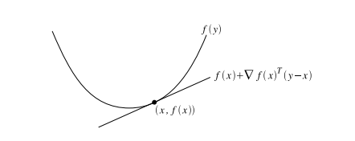

## 1、凸集

定义：对于任意x,y∈集合C，$\theta$∈$\R$，$0 \leq \theta \leq 1$
$$
\theta x +(1- \theta)y ∈C
$$
即，C集合内的任意两点之间的线段都在集合C内。

保持凸集凸性的计算

- 集合交运算

- 仿射变换

  函数f = Ax+b的形式，称函数是仿射的

- 透视变换

- 投射变换

## 2、凸函数

定义：若f的定义域dom f为凸集，且满足
$$
\forall x,y ∈dom f,0 \leq \theta \leq 1,有 \\
f(\theta x +(1- \theta)y) \leq \theta f(x)+(1- \theta) f(y)
$$

若f一阶可微，则函数f为凸函数当且仅当f的定义域 dom f为凸集，且
$$
\forall x,y ∈ dom f,f(y) \geq f(x) + \bigtriangledown f(x)^T (y-e)
$$

即函数的增长(下降)速度要快于(慢于)以当前点的梯度为方向的直线。

若f二阶可微，则函数f为凸函数当且仅当f的定义域 dom f为凸集，且
$$
\bigtriangledown ^2 f(x) \succ =0
$$
若f是一元函数，上式表示二阶导大于等于0

若f是多元函数，上式表示二阶导Hessian矩阵半正定

> 凸函数举例
>
> 指数函数  $e^{ax}$
>
> 幂函数 $x^a$ ，x∈$\in R_{+}$ ,a $\geq$ 1 or a $\leq$0
>
> 负对数函数 -log x
>
> 负熵函数 xlogx
>
> 范数函数 ${||w||}_p$

保持凸函数凸性的计算

- 凸函数的非负加权和
  $$
  f(x) = \omega_1 f_1(x) +... + \omega_n f_n(x)
  $$

- 凸函数与仿射函数的复合
  $$
  g(x) = f(Ax+b)
  $$

- 凸函数的逐点最大值，逐点上确界
  $$
  f(x) = \max (f_1(x), ...,f_n(x)) \\
  f(x) = sup_{y \in A} g(x,y)
  $$

## 3、Jensen 不等式

$$
f(\theta x+(1- \theta x)y) \leq \theta f(x) + (1-\theta) f(y)
$$

若 $\theta_1,...\theta_k  \geq0$, $\theta_1 + ...+\theta_k = 1$

则
$$
f(\theta_1 x_1 + ... +\theta_k x_k \leq \theta_1 f(x_1)+...+\theta_k f(x_k))
$$
可推导出
$$
f(Ex) \leq E(f(x))
$$

