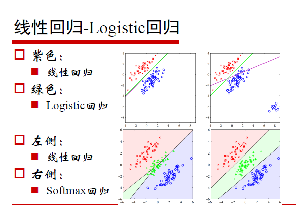
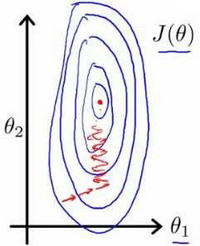
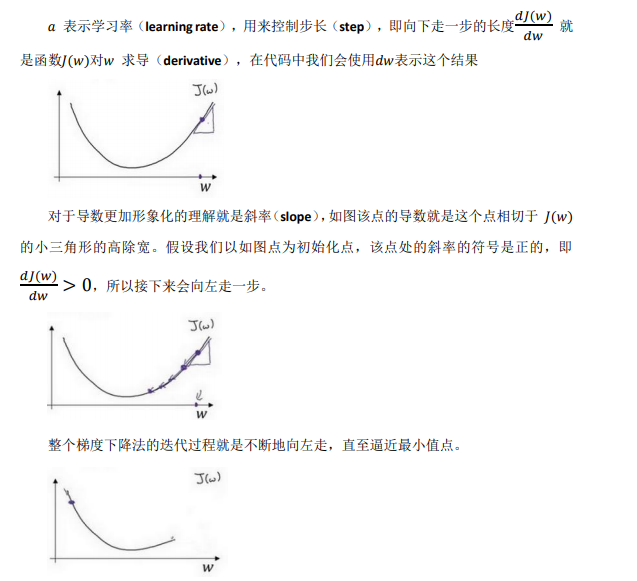

## 1、关于矩阵求导

#### 1.1 基本公式

$$
\frac{\partial \beta^TX}{\partial X}=\beta
$$

如Y = 3$x_1$+2$x_2$+2 即A = $\left[\begin{matrix}3&2&2\end{matrix}\right]$,X = $\left[\begin{matrix}x_1 \\ x_2 \\ x_3 \end{matrix}\right]$,$\frac{DY}{DX}$ = $\left[\begin{matrix}\partial Y/\partial x_1\\\partial Y/\partial x_2\\ \partial Y/\partial x_3\end{matrix}\right]$=$\left[\begin{matrix}3 \\ 2 \\ 2\end{matrix}\right]$

#### 1.2 最小二乘法的参数求解

参考：https://en.wikipedia.org/wiki/Matrix_calculus#Scalar-by-vector_identities
$$
J(\theta) = \frac{1}{2}(h_{\theta}(x)-y)\\
=\frac{1}{2}(X\theta-Y)^T(X\theta-Y)\\
=\frac{1}{2}(\theta^TX^T-Y^T)(X\theta-Y)\\
=\frac{1}{2}(\theta^TX^TX\theta-\theta^TX^TY-Y^TX\theta+Y^TY)
$$
求导
$$
\frac{\partial Y^TY}{\partial \theta} = 0
$$

$$
\frac{\partial \theta^TX^TY}{\partial \theta} = \frac{\partial (\theta^TX^TY)^T}{\partial \theta} = \frac{\partial Y^TX\theta}{\partial \theta}=X^TY
$$

因为分子是标量，标量的转置等于本身，所以对分子进行转置操作时等价的。
$$
\frac{\partial Y^TX\theta}{\partial \theta} = X^TY
$$

$$
\frac{\partial \theta^TX^TX\theta}{\partial \theta} =\frac{\partial （\theta^TX^T）^T}{\partial \theta}\cdot(X\theta)+\frac{\partial X\theta}{\partial \theta}\cdot（\theta^TX^T）^T = 2X^TX\theta
$$

即
$$
\frac{\partial J（\theta）}{\partial \theta} =\frac{1}{2}(2X^TX\theta-2X^TY) = 0
$$
解得
$$
\theta =(X^TX)^{-1}X^TY
$$

## 2、回归问题解决分类？

一般来说，回归不用在分类问题上，因为回归是连续型模型，而且受噪声影响比较大。

## 3、梯度下降与泰勒公式

给出一阶泰勒展开式：
$$
f(\theta) \approx f(\theta_0)+(\theta-\theta_0)\cdot\bigtriangledown f(\theta_0)
$$
在二维空间中展开：

$\theta = (x,y)$

$\theta_0 = (x_0 , y_0)$

因此，通过泰勒展开式可以得到：
$$
f(x,y) = f(x_0, y_0) +(\theta - \theta_0) \cdot \bigtriangledown f(\theta_0)
$$
令 $(\theta - \theta_0) = \eta v$ ，其中$\eta$是标量，v是$\theta -\theta_0$的单位向量，则
$$
f(x,y) = f(x_0, y_0) +\eta v \cdot \bigtriangledown f(\theta_0)
$$
由于是梯度下降法，所以$\eta v \cdot \bigtriangledown f(\theta)$<0，两边除以标量$\eta$，则
$$
v \cdot \bigtriangledown f(\theta_0)<0 \\
v \cdot \bigtriangledown f(\theta_0) = ||v|| \cdot ||f(\theta_0)|| \cdot \cos(\alpha)<0
$$
当v与$f(\theta_0)$为平角时，$v \cdot \bigtriangledown f(\theta_0)$最小，此时$v =  - \bigtriangledown f(\theta_0)$

即 
$$
\theta - \theta_0 = \eta (- \bigtriangledown f(\theta_0))
$$

$$
\theta = \theta_0 -\eta \cdot \bigtriangledown f(\theta_0)
$$

## 4、牛顿法

牛顿法是为了求解函数值为0的时候变量的取值问题的。

一阶方法：

当求解$f(\theta) = 0$，如果f可导，则
$$
\theta: = \theta - \frac{f(\theta)}{f'(\theta)}
$$
二阶方法：

当求解参数和函数极值时，令f(x)二次泰勒展开
$$
f(x)\approx g(x) = f(x_k)+f'(x_k)(x-x_k)+\frac{1}{2}f''(x_k)(x-x_k)^2
$$
令求导函数为0
$$
f'(x_k) + f''(x_k)(x-x_k) = 0
$$

$$
x = x_k - \frac{f'(x_k)}{f''(x_k)}
$$

或者令$f(\theta) = l'(\theta)$，即当$l'(\theta)=0$为极值点，可得到相同结果。

## 5、关于梯度下降

- 如果我们预先把$\theta$放在一个局部的最低点，结果是局部最优点的导数将等于0，因为它是那条切线的斜率，此时梯度下降法不会改变参数的值。

- 当我们面对多维度的特征，我们要保证这些特征都有相近的尺度，这有助于梯度下降算法更快收敛。

  

- 只要特征变量的数目不是很大，标准方程是一个很好的计算$\theta$的替代方法，即$\theta = (X^TX)^{-1}X^TY$。

- 对于线性回归来说，损失函数是最小二乘（注意为什么从最大似然变成求解损失最小），即损失函数求解最小，因此应用梯度下降；对于逻辑回归来说，损失函数是交叉熵，求解的是最大似然，因此应用的是梯度上升，也可以加上负号，应用梯度下降求解最小。

## 6、学习率

